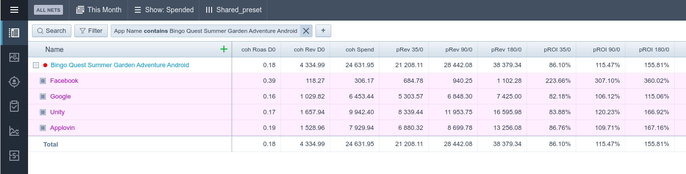

# Release message 4.1

## Внедрение pRev

В статистику и когортный анализатор внедрены метрики pRev

-   В настройках пресетов они находятся в отдельной группе pRev
-   Метрики 0го когортного дня
    -   **cohSpend** - спенд для существующей когорты. Когорты существуют в любую дату меньше чем сегодня. **База для этой метрики - af Cost.**
    -   **cohRev D0** - прибыль 0го дня когорты, которую мы выгрузили из Af Cohorts раздела. Совпадает с первым столбцом когортного анализа.
    -   **cohROAS D0 = cohRev 0D / coh Spend** - роас нулевого дня, совпадает с роасом первого столбца когортного анализа.
-   Метрики pRev
    -   **pRev (35 | 90 | 180)/0 = cohRev 0D \* coef\_(35 | 90 | 180)/0**
        предсказываемый ревеню на 35/90/180 день этой когорты.
        вычисляем по нулевому дню через коэффициент, уникальный для приложения и сетки.
    -   **pROI (35 | 90 | 180)/0 = pRev (35 | 90 | 180)/0 / coh Spend**
        предсказываемый РОИ на 35/90/180 день этой когорты.
        вычисляем через pRev этого дня, деленный на когортный спенд.

**Как обновляется:**

-   в 2 часа ночи выгружаются когорты для подключенных игр. Потом обновляются 28 последних дней статистики, тем самым перезаписывая новые метрики pRev для каждого аккаунта. К началу рабочего времени мы гарантированно получаем рассчитанные метрики pRev.
-   Работает только для игр Bingo Andoid, Bingo IOS. Коэффициенты зашиты в код.

## Тикток - привязка ассетов

В тикток статистике и анализаторе появилась привязка ассетов.

-   Можно смотреть превью
-   Можно выделять, копировать названия, загружать файлы, ставить теги и добавлять Note.

## Apple - выгрузка разбивки keywords

В Apple добавлена выгрузка разбивки keywords.

Свести выгрузку кампаний к этой разбивке не удалось изза ограничений апи, так что выгрузка кампаний осталась старая.

## Другие изменения и правки багов

-   В Youtube mass import теперь при успешном экспорте будет показана плашка с результатом.
-   Улучшен UI выбора сеток в статистике.
-   Восстановлен показ Tar Kpi на при выборе сетки и объектов ниже в когортной панели.
-   Adjust добавлены новые метрики - adj adRevenue Nd + adj adROAS Nd, adj allRevenue Nd + adj allROAS Nd.
-   Решена проблема с рандомным обнулением af Cost, когда appsflyer мог терять свои метрики в выгрузке в рандомные моменты дня. Панель будет перезаписывать метрики только если они возрастают.
-   Appsflyer Cohort выгрузка доработана и распараллелена на несколько подключенных игр.
